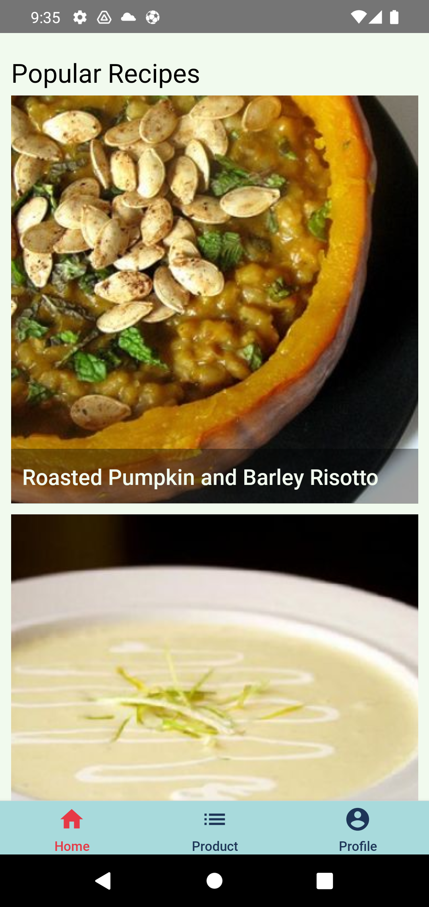
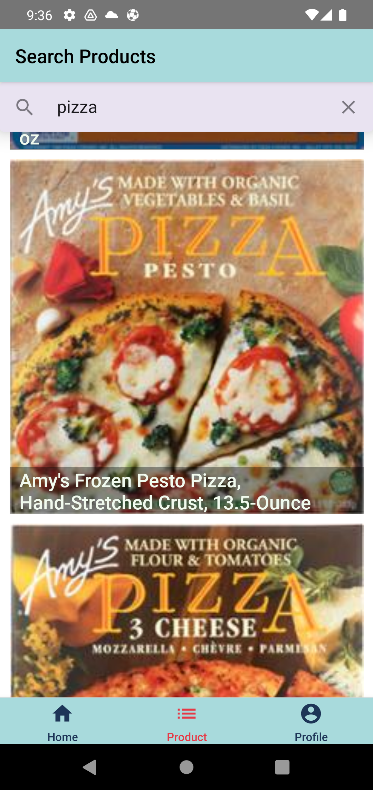
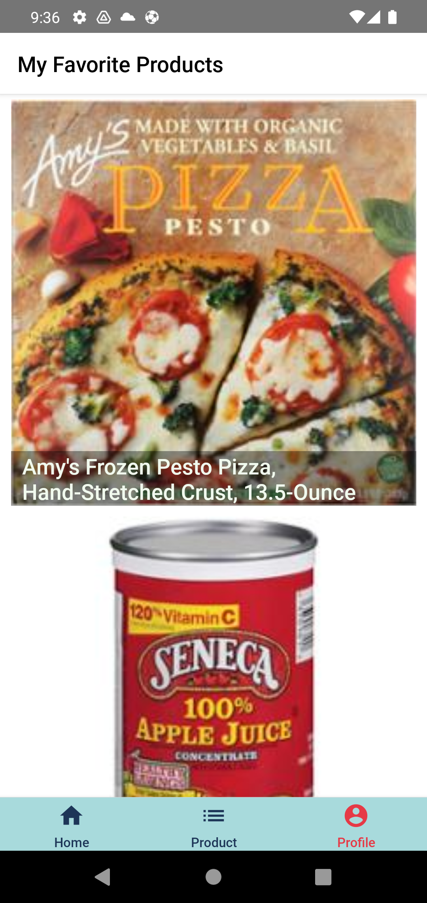
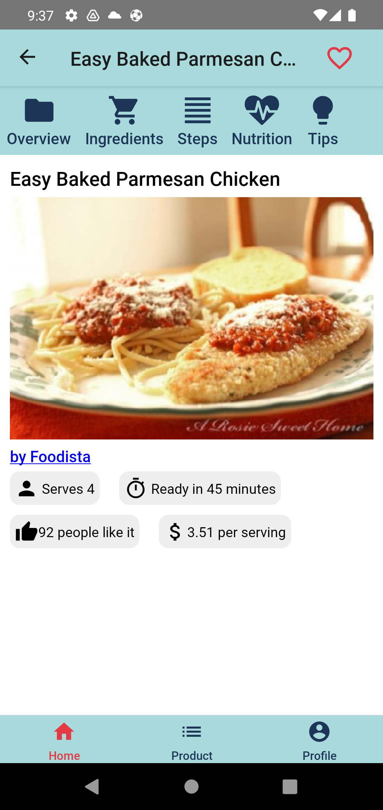
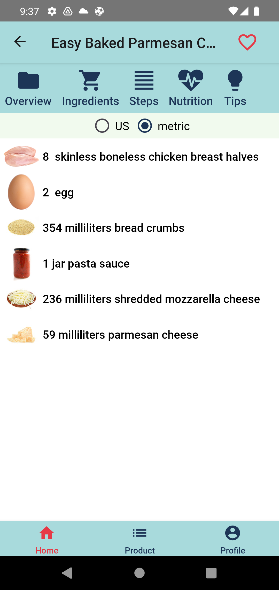
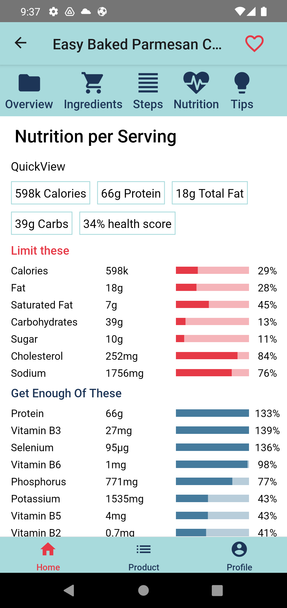

# Lembas

## Food application developed by react native

- [spoonacular api](https://spoonacular.com/food-api) used in this application

### Lembas is [spoonacular food companion](https://play.google.com/store/apps/details?id=app.com.spoonacular&gl=US) clone

  

  
